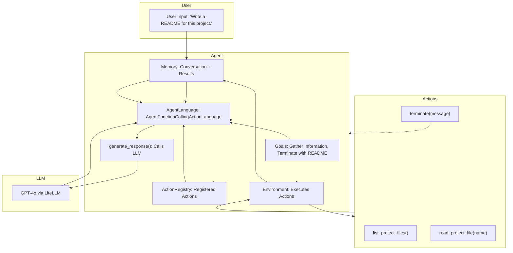
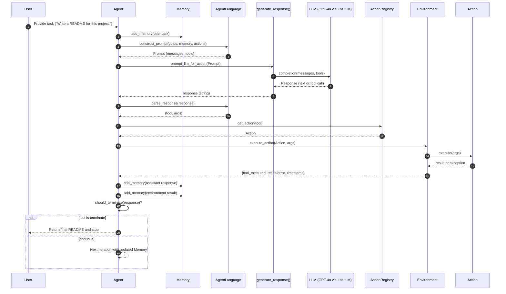

# Agent Design Diagrams

## 1. Architecture (Flowchart)


## 2. Agent Sequence Diagram


## 3. Agent Swimlane Diagram
```mermaid
flowchart LR
  %% Lanes as subgraphs
  subgraph Lane_User[User]
    U1[Provide task]
    U2[Receive final README]
  end

  subgraph Lane_Agent[Agent]
    A1[Store task in Memory]
    A2["Construct Prompt (Goals + Memory + Actions)"]
    A3[Parse model response]
    A4[Lookup Action]
    A5[Decide continue or terminate]
  end

  subgraph Lane_LLM[LLM]
    L1[Generate response]
  end

  subgraph Lane_Env[Environment]
    E1[Execute Action]
    E2[Wrap Result]
  end

  subgraph Lane_Actions[Actions]
    Ac1[list_project_files()]
    Ac2["read_project_file(name)"]
    Ac3["terminate(message)"]
  end

  %% Cross-lane flow
  U1 --> A1
  A1 --> A2
  A2 --> L1
  L1 --> A3
  A3 --> A4
  A4 --> E1
  E1 --> Ac1
  E1 --> Ac2
  E1 --> Ac3
  Ac1 --> E2
  Ac2 --> E2
  Ac3 --> E2
  E2 --> A5
  A5 -.-> A2
  A5 -.-> U2
```
